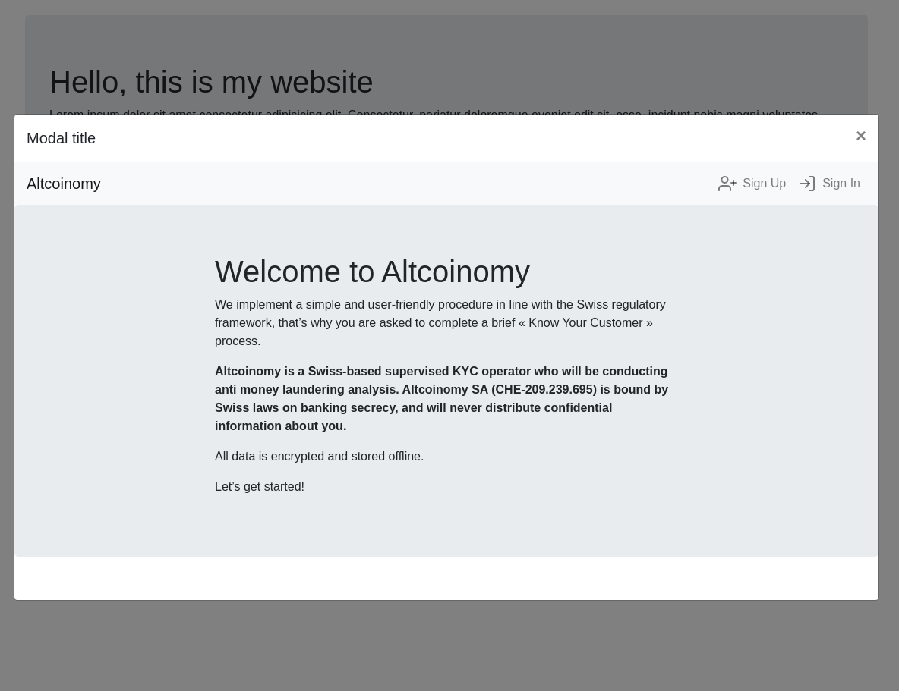

# Issuance React sample

This is a React implementation of the issuance.ch platform. It communicates directly with Altcoinomy's API.

You will find the React application as well as a demonstration of how to implement it in your webpage.

## Deploy the React app

For this purpose we assume that you have npm installed on your machine.

### Development

If you want to change the design of the embeded platform, you can edit the current source code and change the css styles and react pages. If you run the development environment, you will have access to a live reload which will reload the react app after every change in your application.

Run the following commands:

```bash
npm install
cp src/config.js.spec src/config.js
npm start
```

Server will be running on your [http://localhost:3000](localhost).

### Build production version

```bash
npm install
cp src/config.js.spec src/config.js
npm run build
```

## Sample

### Run the POC first

Once you have built the react app, you can serve it through a web server as a static website or simply use a famous npm package [https://www.npmjs.com/package/http-server](http-server) in order to serve your built react app.

```bash
npm install -g http-server
cd build
http-server ./
```

Your react app will then run on [http://localhost:8080](http://localhost:8080).

### Try the sample




A bootstrap demo is available in the `samples/bootstrap-integration` folder. If the POC is running on [http://localhost:8080](http://localhost:8080) you can simply load the index.html file to see how you can integrate the POC in your basic bootstrap website.

> Note: If you want to change the URL you just need to edit the `samples/bootstrap-integration/index.html` file and change the iframe target.


## Referral management

If you need to pass some referal to your page in order to feed the customer referral tag, you can use the following :
[http://localhost:3000/?referral=my-tag](http://localhost:3000/?referral=my-tag).

Note that the referal will be stored in the sessionStorage and any user registering after using this link will get the referal fed in the customer object.
